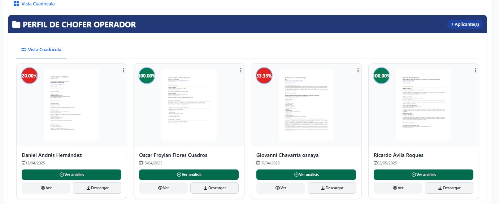

Esta sección del módulo de Reclutamiento permite visualizar, analizar y evaluar los currículums recibidos mediante un sistema avanzado de inteligencia artificial que proporciona calificaciones automáticas y recomendaciones detalladas.

## Visualización de CVs

El sistema presenta todos los currículums recibidos de manera organizada y estructurada, facilitando la revisión y comparación entre candidatos.

### Características Principales

**Vista Centralizada:** Todos los CVs se muestran en una interfaz unificada que permite una revisión eficiente y sistemática.

**Información del Candidato:** Cada CV muestra los datos esenciales del postulante, incluyendo información personal, experiencia laboral, educación y habilidades relevantes.

**Estado de Revisión:** Indicadores visuales que muestran el progreso de evaluación de cada candidato en el proceso de selección.

## Sistema de Calificaciones con IA

### Evaluación Automática

La inteligencia artificial analiza cada currículum y genera una calificación basada en múltiples criterios:

**Compatibilidad con el Puesto:** Evalúa qué tan bien se ajusta el perfil del candidato a los requisitos específicos de la vacante.

**Experiencia Relevante:** Analiza los años de experiencia y la relevancia de los roles anteriores en relación con la posición solicitada.

**Habilidades Técnicas:** Identifica y evalúa las competencias técnicas mencionadas en el CV en comparación con las requeridas.

**Formación Académica:** Considera el nivel educativo y la relevancia de los estudios realizados.

### Escala de Calificación

El sistema utiliza una escala clara y comprensible que permite identificar rápidamente a los candidatos más prometedores:

- **Excelente Match (90-100%):** Candidatos que cumplen excepcionalmente con los requisitos
- **Buen Match (70-89%):** Candidatos que se ajustan bien al perfil solicitado
- **Match Moderado (50-69%):** Candidatos con potencial que requieren evaluación adicional
- **Match Bajo (30-49%):** Candidatos con algunas coincidencias pero deficiencias significativas
- **Sin Match (0-29%):** Candidatos que no se ajustan al perfil requerido

## Recomendaciones Inteligentes

### Análisis Detallado

Para cada candidato, la IA proporciona recomendaciones específicas y detalladas:

**Fortalezas Identificadas:** Destaca los aspectos más relevantes y atractivos del perfil del candidato.

**Áreas de Oportunidad:** Señala las competencias o experiencias que podrían requerir desarrollo o capacitación.

**Sugerencias de Entrevista:** Propone temas específicos a explorar durante el proceso de entrevista.

### Comparación entre Candidatos

**Ranking Automático:** Los candidatos se ordenan automáticamente según su compatibilidad con la vacante.

**Análisis Comparativo:** Facilita la identificación de las diferencias clave entre los mejores candidatos.

**Recomendaciones de Selección:** Sugiere cuáles candidatos deberían avanzar a la siguiente etapa del proceso.

## Funcionalidades Adicionales

### Filtros Inteligentes

**Por Calificación:** Permite filtrar candidatos según rangos de puntuación específicos.

**Por Experiencia:** Filtra según años de experiencia en roles similares.

**Por Ubicación:** Organiza candidatos según su ubicación geográfica.

**Por Disponibilidad:** Identifica candidatos según su disponibilidad para incorporarse.

### Exportación y Reportes

**Reportes de Evaluación:** Genera reportes detallados de la evaluación de cada candidato.

**Comparativos:** Crea documentos comparativos entre los mejores candidatos.

**Métricas del Proceso:** Proporciona estadísticas sobre la efectividad del proceso de reclutamiento.

## Beneficios del Sistema

### Eficiencia Mejorada

- **Reducción de Tiempo:** Automatiza la revisión inicial de CVs, reduciendo significativamente el tiempo de preselección
- **Consistencia:** Aplica criterios uniformes a todos los candidatos, eliminando sesgos subjetivos
- **Priorización:** Identifica automáticamente a los candidatos más prometedores

### Calidad en la Selección

- **Análisis Profundo:** Evalúa múltiples dimensiones del perfil de cada candidato
- **Recomendaciones Basadas en Datos:** Proporciona insights objetivos para la toma de decisiones
- **Predicción de Éxito:** Ayuda a predecir la probabilidad de éxito del candidato en el puesto

### Experiencia del Reclutador

- **Interface Intuitiva:** Presenta la información de manera clara y accesible
- **Herramientas de Colaboración:** Facilita el trabajo en equipo durante el proceso de selección
- **Seguimiento Integral:** Permite monitorear el progreso de cada candidato a lo largo del proceso

---

Este sistema de gestión de CVs con IA representa una evolución significativa en los procesos de reclutamiento, combinando la eficiencia de la automatización con la precisión del análisis inteligente para optimizar la selección de talento.