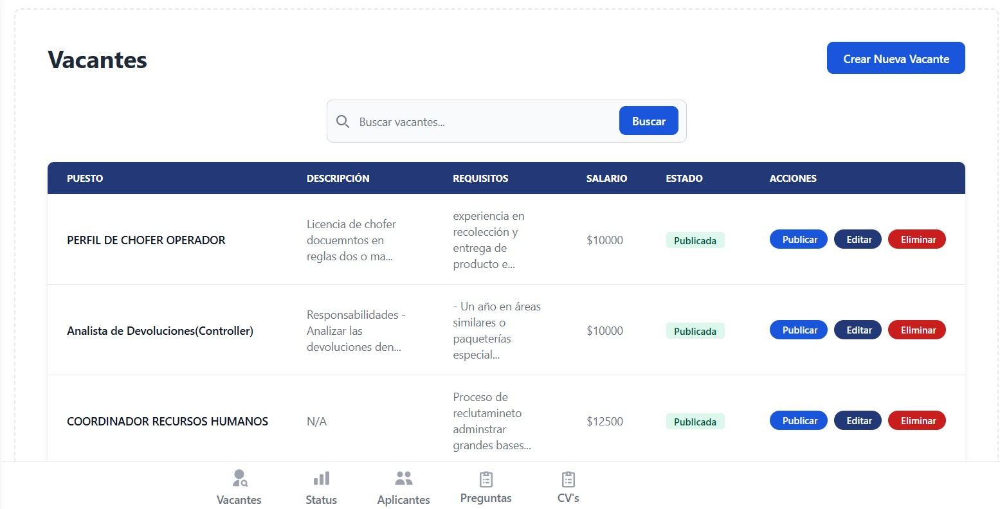
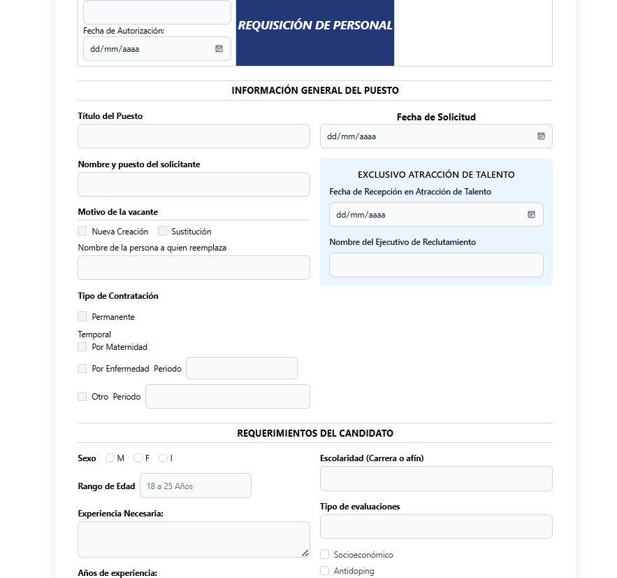
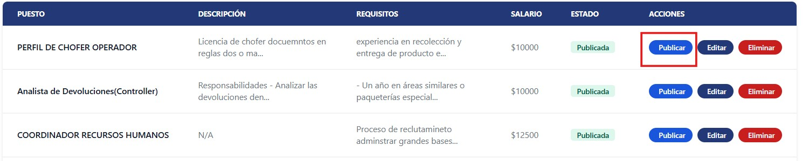

Esta es la pantalla de inicio del módulo de Reclutamiento, diseñada para iniciar el proceso de **requisición de personal**.

                                                

## 1. Iniciar la Requisición de Personal

El primer paso es completar el formulario de requisición de personal. Aquí se deben ingresar todos los detalles necesarios para definir la vacante.

### Llenado de Datos
Es crucial completar con precisión todos los campos del formulario. La información ingresada, como el puesto, la descripción de las responsabilidades, los requisitos de experiencia y habilidades, y la ubicación, son de suma importancia.

### Match con la Vacante
Los datos proporcionados en esta etapa son fundamentales para el sistema. Serán utilizados para hacer **match** con los perfiles de los candidatos y son la base para la evaluación futura del mismo. Una definición clara y detallada de la vacante asegura que el proceso de evaluación de los candidatos sea preciso y relevante.

## 2. Publicar la Vacante

Una vez que se han llenado todos los datos de la requisición, el siguiente paso es **publicar la vacante**. Esto hará que la oferta de empleo sea visible para los candidatos interesados, dando inicio al proceso de atracción de talento.

## Consideraciones Importantes

- Asegúrate de completar todos los campos obligatorios.
- Proporciona descripciones claras y detalladas de los requisitos.
- Revisa la información antes de publicar la vacante.
- Los datos ingresados serán la base para el matching automático con candidatos.
- La publicacion de cv tarde de 2 hrs a  4 hrs. 