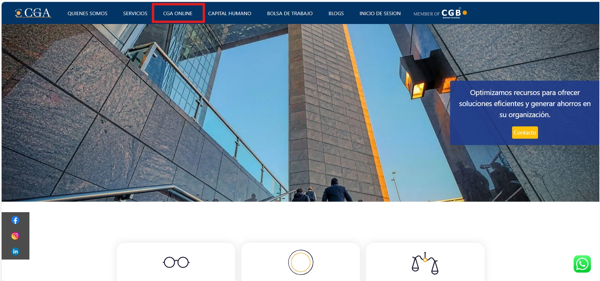
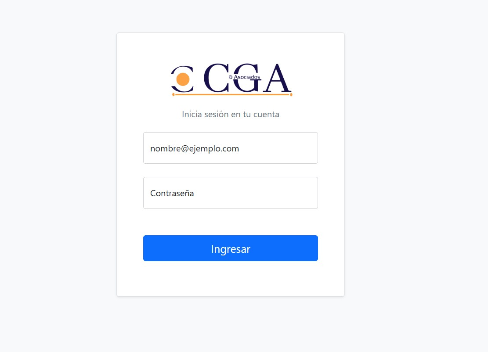

Para acceder a la plataforma CGA Online y comenzar a utilizar todas sus funcionalidades, sigue estos sencillos pasos:

## Acceso a la Plataforma

### Paso 1: Ingresa a la página web
Dirígete a **www.cga-asociados.com** desde tu navegador web preferido.

### Paso 2: Accede a CGA Online
Una vez en la página principal, busca y haz clic en el apartado de **"CGA Online"** para dirigirte al portal de acceso.

### Paso 3: Introduce tus credenciales
En la pantalla de inicio de sesión, ingresa tu **usuario** y **contraseña** en los campos correspondientes.

## Consideraciones Importantes

- Asegúrate de tener una conexión estable a internet
- Verifica que tus credenciales sean correctas
- Si tienes problemas para acceder, contacta al equipo de soporte técnico

## Próximos Pasos

Una vez que hayas iniciado sesión exitosamente, podrás acceder a todos los módulos y funcionalidades disponibles en la plataforma CGA Online.